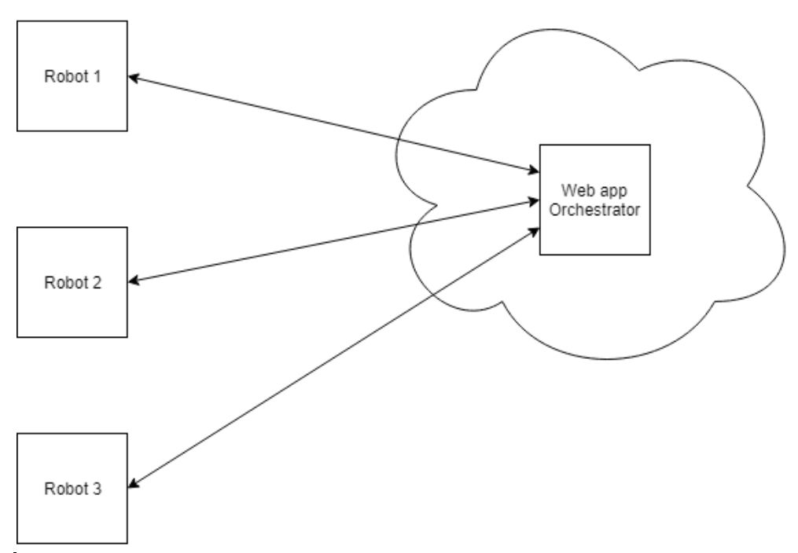
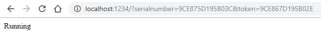

# G1ANT.Robot.API

As a developer, we would like to have remote access to G1ANT.Robot by built-in WebServer and REST:

1. For remote control
2. For remote management
3. For remote administration
4. For remote development (spread the processes)

Everything from that is possible with G1ANT.Robot.API feature. Everybody can build
G1ANT.Orchestrator (for Azure, for our own or connector to any different system), by using this API.



## Settings

First of all, we have to find G1ANT.Robot.config file which is stored in user Documents\G1ANT.Robot folder.
We have to put the last <WebServer> section:

```XML
<?xml version="1.0"?>
<Settings xmlns:xsd="http://www.w3.org/2001/XMLSchema" xmlns:xsi="http://www.w3.org/2001/XMLSchema-instance" xmlns="http://g1ant.com/XmlSchema/v3/Settings">
 ...
 <WebServer>
  <Enabled>true</Enabled>
  <Port>1234</Port>
    <Tokens>
      <Token Name="Chris" Value="9CE867D195B02E" />
    </Tokens>
  </WebServer>
</Settings>
```

Whereas

Name | Description
-----|------------
**Enabled** | API can be enabled (true) or no (false)
**Port** | On which port our API should be available? 1234 is ok.
**Tokens** | List of tokens for authorisation. Value is the key. Name is for our information only.

## Authorisation, status

Each query should have two parameters to authorise transaction: token from settings file and serial of our program. 
Let's execute our first query. For example, let's check our API by this URL entered in the web browser.

```
http://localhost:1234/?serialnumber=...&token=9CE867D195B02E
```

whereas in the `...` you should enter the serial number of your program. As we can see, our API is working fine.



## List of all commands

There are example how to use API from G1ANT.Robot.

```G1ANT
♥machine = localhost
♥token = 9CE867D195B02E
♥serialnumber = ...
♥port = 1234

call Api query / method GET
dialog ♥result

procedure Api query ‴‴ body ‴‴ filename ‴‴ method ‴POST‴ parameters ‴‴
    if ♥token==""
        error ‴Enter the token‴
    end
    ♥url = http://♥machine:♥port♥query/?token=♥token&serialnumber=♥serialnumber&♥parameters
    ⊂
        string url = ♥url;
        System.Net.ServicePointManager.Expect100Continue = true;
        System.Net.ServicePointManager.SecurityProtocol = System.Net.SecurityProtocolType.Tls12;
        if (♥filename != "")
        {
            System.IO.FileInfo file = new System.IO.FileInfo(♥filename);
            int fileLength = (int)file.Length;

            string boundary = "---------------------------" + DateTime.Now.Ticks.ToString("x");
            byte[] boundarybytes = System.Text.Encoding.ASCII.GetBytes("\r\n--" + boundary + "\r\n");

            System.Net.HttpWebRequest request = (System.Net.HttpWebRequest)System.Net.WebRequest.Create(url);
            request.ContentType = "multipart/form-data; boundary=" + boundary;
            request.Method = "POST";
            request.KeepAlive = true;

            using (System.IO.Stream stream = request.GetRequestStream())
            {
                stream.Write(boundarybytes, 0, boundarybytes.Length);

                byte[] headerbytes = System.Text.Encoding.UTF8.GetBytes(
                    "Content-Disposition: form-data; name=\"content\"; filename=\"" + file.Name + "\"\r\n\r\n");
                stream.Write(headerbytes, 0, headerbytes.Length);

                System.IO.FileStream fileStream = new System.IO.FileStream(♥filename, System.IO.FileMode.Open, System.IO.FileAccess.Read);
                stream.Write(System.IO.File.ReadAllBytes(♥filename), 0, fileLength);
                fileStream.Close();

                byte[] trailer = System.Text.Encoding.ASCII.GetBytes("\r\n--" + boundary + "--\r\n");
                stream.Write(trailer, 0, trailer.Length);
            }
            using (System.IO.Stream stream = request.GetResponse().GetResponseStream())
                return new System.IO.StreamReader(stream).ReadToEnd();
        }
        else if (♥method == "POST" || ♥method == "PUT")
        {
            System.Net.WebClient client = new System.Net.WebClient();
            return client.UploadString(♥url, ♥method, ♥body);
        }
        else if (♥method == "GET")
        {
            System.Net.WebClient client = new System.Net.WebClient();
            return client.DownloadString(♥url);
        }
        else
            throw new NotImplementedException();
    ⊃
end

```

### GET: Addon/List 

Will give list of all installed addons on that robot

```G1ANT
call Api query /addon/list method GET
```

Result:

```json
[ 
   { 
      "Name":"G1ANT.Addon.Core",
      "Version":"4.104.0.0"
   },
   { 
      "Name":"G1ANT.Addon.GoogleDocs",
      "Version":"4.102.0.0"
   },
   { 
   ...
]
```

### POST: Addon/Put

Send addon DLL to instance of robot.

```G1ANT
call Api query /addon/put filename c:\users\chris\downloads\G1ANT.Addon.Command.Hello.dll method POST
```

Result

```json
[ 
   { 
      "Key":"G1ANT.Addon.Command.Hello.dll",
      "Value":"RestartRequiredToLoadAddon"
   }
]
```

### GET: Processes/List

Get list of all installed processes on the local computer:

```G1ANT
call Api query /processes/list method GET
```

Result

```
MyDocuments\amazon-search.G1ANT
MyDocuments\AutoSave.G1ANT
MyDocuments\azure-text-analytics-rest.G1ANT
MyDocuments\Challenge.InputForms.V1.G1ANT
MyDocuments\challenge.InvoiceExtraction-V1.G1ANT
MyDocuments\Challenge.ShortestPath.V1.G1ANT
---------------------------

```

### GET: Processes/Get

Get the full process body.

```G1ANT
call Api query /processes/get method GET parameters name=MyDocuments\Notepad.G1ANT
```

Result
```
addon core version 4.104.0.0
addon language version 4.105.0.0

program notepad
keyboard hello!
```

### POST: Processes/Break

Break the current process.

```G1ANT
call Api query /processes/break method POST
```

### POST: Processes/Start 

Execute process from the local robot instance.

```G1ANT
call Api query /processes/start method POST parameters name=Notepad.G1ANT
```

### POST: Processes/Run

Execute any process which is attached as body.

```G1ANT
call Api query /processes/run method POST parameters name=Hello.G1ANT body ‴addon language version 4.105.0.0‴
```

### PUT: Processes/Put

Save script to the local Robot storage.

```G1ANT
♥body = ⊂System.IO.File.ReadAllText(@"c:\users\chris\downloads\hello.G1ANT")⊃
call Api query /processes/put method PUT parameters ‴name=hello.G1ANT‴ body ♥body
```

After that, can be loaded from the menu Process/Open <Ctrl+O>.

## GET: Triggers/Settings/Get

Get settings section for the all triggers on the local G1ANT.Robot

```G1ANT
call Api query /triggers/settings/get method GET 
dialog ♥result
```

Result

```XML
<Triggers xmlns="http://g1ant.com/XmlSchema/v3/Settings">
  <Trigger Name="test" TaskName="C:\Users\G1ANT\Documents\G1ANT.Robot\FileTrigger.G1ANT" Class="FileTrigger">
    <Arguments>
      <Argument Key="directory">C:\TestDir</Argument>
    </Arguments>
    <Filters />
  </Trigger>
</Triggers>
```

## POST: Triggers/Settings/Set

Setup settings section for the all triggers on the local G1ANT.Robot

```G1ANT
♥triggers = ⊂System.IO.File.ReadAllText(@"c:\users\chris\downloads\triggers.xml")⊃
call Api query /triggers/settings/set method POST parameters triggersxml=♥triggers
```

## POST: Triggers/Enable

Enable triggers instance.

```
call Api query /triggers/enable method POST
```

## POST: Triggers/Disable

Disable triggers instance.

```
call Api query /triggers/disable method POST
```

## Subscriptions service

By subscriptions service we can subscribe events generated by local G1ANT.Robot:

1. TriggerStatusChanged (Enabled/Disabled)
2. TriggerRaised (TriggerName)
3. ProgramStatusChanged (Started/Ended)
4. ProcessStop (Name, FinishDate, ExecutionTime, Satus, Error)
5. ProcessStart (Name, StartDate, IsTriggered, Scripter)
6. CommandExecutedEvent (LineNumber)

## GET: Subscriptions/List

Give us list of all available subscriptions on that robot instance.

```G1ANT
call Api query /subscriptions/list method GET
dialog ♥result
```

## POST: Subscriptions/Start

Start subscription


```G1ANT
♥subscription = ⊂System.IO.File.ReadAllText(@"c:\users\chris\downloads\subscription.xml")⊃
call Api query /subscriptions/start method POST parameters subscriptionxml=♥subscription
```

whereas subscription.xml is file like that

```XML
<Subscription event=””>
	<Url>callback url</Url>
<Subscription>
```

## POST: Subscriptions/Stop

Stop subscription

```G1ANT
♥subscription = ⊂System.IO.File.ReadAllText(@"c:\users\chris\downloads\subscription.xml")⊃
call Api query /subscriptions/stop method POST parameters subscriptionxml=♥subscription
```

whereas subscription.xml is file like that

```XML
<Subscription event=””>
	<Url>callback url</Url>
<Subscription>
```
