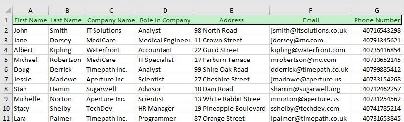
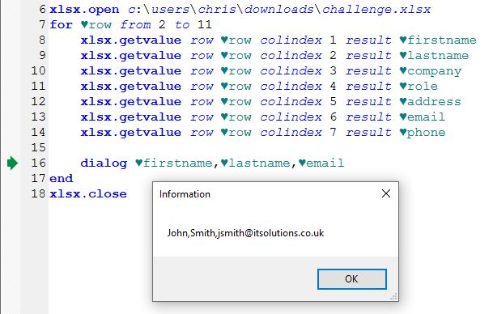
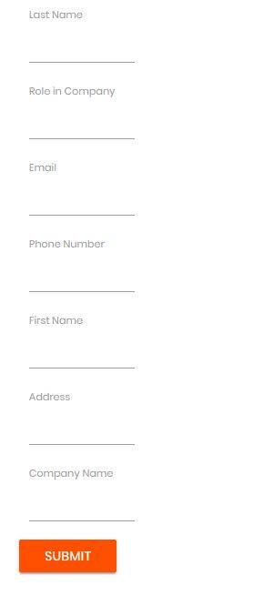
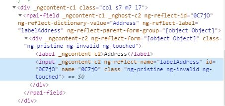
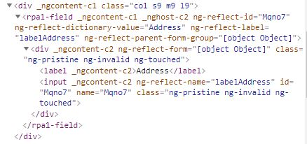
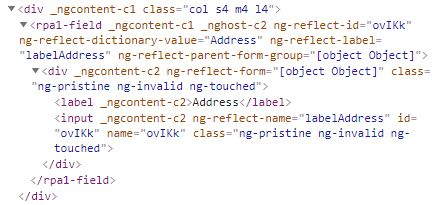

# rpachallenge.com Input Forms

You can find out this excersise on the website [RPAChallenge.com](https://rpachallenge.com/):

1. The goal of this challenge is to create a workflow that will input data from a spreadsheet into the form fields on the screen.
2. Beware! The fields will change position on the screen after every submission throughout 10 rounds thus the workflow must correctly identify where each spreadsheet record must be typed every time.
3. The actual countdown of the challenge will begin once you click the Start button until then you may submit the form as many times as you wish without receiving penalties.

## Loading data from the excel file

The excel has some information we should put on the website:



So, first of all, we should open that excel file in G1ANT 
and record by record put these information on the website in the correct way.
There are two addons, which we can use:

1. **xlsx** [(G1ANT.Addon.Xlsx.dll)](https://manual.g1ant.com/G1ANT.Addons/G1ANT.Addon.Xlsx/Addon.md) - faster method, and don't need Microsoft Office installed
2. **msoffice** [(G1ANT.Addon.Msoffice.dll)](https://manual.g1ant.com/G1ANT.Addons/G1ANT.Addon.MSOffice/Addon.md) - slower method, which are using Microsoft Office

This is hackaton, so our goal is to solve the problem as soon as possible, 
so we will choose **xlsx**:

<!-- TODO: xlsx.gettable [sheet ... [from ...] [to ...]] result ... -->

```G1ANT
xlsx.open challenge.xlsx
for ♥row from 2 to 11
    xlsx.getvalue row ♥row colindex 1 result ♥firstname
    xlsx.getvalue row ♥row colindex 2 result ♥lastname
    xlsx.getvalue row ♥row colindex 3 result ♥company
    xlsx.getvalue row ♥row colindex 4 result ♥role
    xlsx.getvalue row ♥row colindex 5 result ♥address
    xlsx.getvalue row ♥row colindex 6 result ♥email
    xlsx.getvalue row ♥row colindex 7 result ♥phone
 
    dialog ♥firstname,♥lastname,♥email
end
xlsx.close
```

Let's execute this script by <ctrl+F9> and check it out 
how the data is loading from the excel file:



You can break up the script by pressing <Ctrl+F12>. 
As You can see, I've used full path to the **challenge.xlsx** file.

## Put data to the web

As you can observe, the difficulties of our excersise 
is based on changing the web form after each **submit**.

Iteration 1 | Iteration 2 | Iteration 3
----------- | ----------- | -----------
 |  | 

How it's happened? When we **Inspect **input element on Google Chrome by pressing <Ctrl+Shift+I>, 
we can see HTML body of each element, and it's changing also:

Iteration 1 | Iteration 2 | Iteration 3
----------- | ----------- | -----------
 |  | 