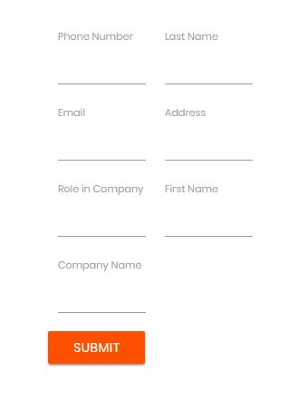

# RPAChallenge.com Input Forms

You can find out this excersise on the website [RPAChallenge.com](http://rpachallenge.com/):

1. The goal of this challenge is to create a workflow that will input data from a spreadsheet into the form fields on the screen.
2. Beware! The fields will change position on the screen after every submission throughout 10 rounds thus the workflow must correctly identify where each spreadsheet record must be typed every time.
3. The actual countdown of the challenge will begin once you click the Start button until then you may submit the form as many times as you wish without receiving penalties.

## Loading data from the excel file

The excel has some information we should put on the website:


So, first of all, we should open that excel file in G1ANT 
and record by record put these information on the website in the correct way.
There are two addons, which we can use:

1. **xlsx** [(G1ANT.Addon.Xlsx.dll)](https://manual.g1ant.com/G1ANT.Addons/G1ANT.Addon.Xlsx/Addon.md) - faster method, and don't need Microsoft Office installed
2. **msoffice** [(G1ANT.Addon.Msoffice.dll)](https://manual.g1ant.com/G1ANT.Addons/G1ANT.Addon.MSOffice/Addon.md) - slower method, which are using Microsoft Office

This is hackaton, so our goal is to solve the problem as soon as possible, 
so we will choose **xlsx**:

<!-- TODO: xlsx.gettable [sheet ... [from ...] [to ...]] result ... -->

```G1ANT
xlsx.open challenge.xlsx
for ♥row from 2 to 11
    xlsx.getvalue row ♥row colindex 1 result ♥firstname
    xlsx.getvalue row ♥row colindex 2 result ♥lastname
    xlsx.getvalue row ♥row colindex 3 result ♥company
    xlsx.getvalue row ♥row colindex 4 result ♥role
    xlsx.getvalue row ♥row colindex 5 result ♥address
    xlsx.getvalue row ♥row colindex 6 result ♥email
    xlsx.getvalue row ♥row colindex 7 result ♥phone
 
    dialog ♥firstname,♥lastname,♥email
end
xlsx.close
```

Let's execute this script by <ctrl+F9> and check it out 
how the data is loading from the excel file:


You can break up the script by pressing <Ctrl+F12>. 
As You can see, I've used full path to the **challenge.xlsx** file.

## Put data to the web

As you can observe, the difficulties of our excersise 
is based on changing the web form after each **submit**.

Iteration 1 | Iteration 2 | Iteration 3
----------- | ----------- | -----------
 |  | 

How it's happened? When we **Inspect **input element on Google Chrome by pressing <Ctrl+Shift+I>, 
we can see HTML body of each element, and it's changing also:

Iteration 1 | Iteration 2 | Iteration 3
----------- | ----------- | -----------
 |  | 

## Javascript getElementByXpath()

Note: one small hack, we can execute that script in the Google Chrome console 
and we will have new very usefull function to find out HTML elements:

```JavaScript
function getElementByXpath(path) {
  return document.evaluate(path, document, null, XPathResult.FIRST_ORDERED_NODE_TYPE, null).singleNodeValue;
}
```

From now, it's possible to search all HTML items by [XPath](https://www.w3schools.com/xml/xpath_syntax.asp).
For example, if we want to find out red start button, which is defined by:


```html
<button ...>...</button>
```

You can click this by entering code above in the Google Chrome Console:

```JavaScript
getElementByXpath('//button').click()
```

## Let's start coding with G1ANT

Let's prepare header for our G1ANT script:

```G1ANT
selenium.open chrome url http://rpachallenge.com/ 
-- enter your correct path
xlsx.open challenge.xlsx

dialog start
selenium.click search //button by xpath
for ♥row from 2 to 11
```

As you can see, the hackaton calculation will start only when we click **OK** 
button in the information dialog. Let's fill all other HTML elements. All have 
the same attribute name **ng-reflect-name** which contains the label name:
labelFirstName, labelLastName, labelCompanyName, labelRole, 
labelAddress, labelEmail, labelPhone. Let's try examples below in the 
Google Chrome Console.

```JavaScript
getElementByXpath("//input[@ng-reflect-name='labelFirstName']")
getElementByXpath("//input[@ng-reflect-name='labelLastName']")
getElementByXpath("//input[@ng-reflect-name='labelCompanyName']")
getElementByXpath("//input[@ng-reflect-name='labelRole']")
getElementByXpath("//input[@ng-reflect-name='labelAddress']")
getElementByXpath("//input[@ng-reflect-name='labelEmail']")
getElementByXpath("//input[@ng-reflect-name='labelPhone']")
```

The last element to find out is **SUBMIT **button. Try to find this alone. 

## First script version

We should use these G1ANT's commands:
1. To change HTML element: **selenium.type**
2. To press key: **selenium.presskey**

The all script below:

```G1ANT
selenium.open chrome url http://rpachallenge.com/ 
xlsx.open c:\users\chris\downloads\challenge.xlsx

dialog start
selenium.click search //button by xpath
for ♥row from 2 to 11
    xlsx.getvalue row ♥row colindex 1 result ♥firstname
    xlsx.getvalue row ♥row colindex 2 result ♥lastname
    xlsx.getvalue row ♥row colindex 3 result ♥company
    xlsx.getvalue row ♥row colindex 4 result ♥role
    xlsx.getvalue row ♥row colindex 5 result ♥address
    xlsx.getvalue row ♥row colindex 6 result ♥email
    xlsx.getvalue row ♥row colindex 7 result ♥phone
 
    selenium.type ♥firstname search //input[@ng-reflect-name='labelFirstName'] by xpath 
    selenium.type ♥lastname search //input[@ng-reflect-name='labelLastName'] by xpath 
    selenium.type ♥company search //input[@ng-reflect-name='labelCompanyName'] by xpath 
    selenium.type ♥role search //input[@ng-reflect-name='labelRole'] by xpath 
    selenium.type ♥address search //input[@ng-reflect-name='labelAddress'] by xpath 
    selenium.type ♥email search //input[@ng-reflect-name='labelEmail'] by xpath 
    selenium.type ♥phone search //input[@ng-reflect-name='labelPhone'] by xpath 
    selenium.presskey enter search //input[@type='submit'] by xpath
end
xlsx.close
```

Let's try this one. The last RPAChallenge's screen should be like this:


# window command

The last thing. We can use `window` command instead of `dialog start`. It means, 
the filling process will start when html will be loaded into the browser, 
and the page will have title "Rpa Challenge - Google Chrome". 
You can check all open windows by pressing <ctrl+W> in G1ANT.Studio (menu Tools->Windows).

The window command has implemented timeout mechanism (check argument `timeout`), 
and if the expected window will not appear, the error will be thrown. The new script, 
with the maximum timeout 100 seconds:

```G1ANT
selenium.open chrome url http://rpachallenge.com/ 
xlsx.open c:\users\chris\downloads\challenge.xlsx

window ‴Rpa Challenge - Google Chrome‴ timeout 100000
selenium.click search //button by xpath
for ♥row from 2 to 11
    xlsx.getvalue row ♥row colindex 1 result ♥firstname
    xlsx.getvalue row ♥row colindex 2 result ♥lastname
    xlsx.getvalue row ♥row colindex 3 result ♥company
    xlsx.getvalue row ♥row colindex 4 result ♥role
    xlsx.getvalue row ♥row colindex 5 result ♥address
    xlsx.getvalue row ♥row colindex 6 result ♥email
    xlsx.getvalue row ♥row colindex 7 result ♥phone
 
    selenium.type ♥firstname search //input[@ng-reflect-name='labelFirstName'] by xpath 
    selenium.type ♥lastname search //input[@ng-reflect-name='labelLastName'] by xpath 
    selenium.type ♥company search //input[@ng-reflect-name='labelCompanyName'] by xpath 
    selenium.type ♥role search //input[@ng-reflect-name='labelRole'] by xpath 
    selenium.type ♥address search //input[@ng-reflect-name='labelAddress'] by xpath 
    selenium.type ♥email search //input[@ng-reflect-name='labelEmail'] by xpath 
    selenium.type ♥phone search //input[@ng-reflect-name='labelPhone'] by xpath 
    selenium.presskey enter search //input[@type='submit'] by xpath
end
xlsx.close
```

<!-- The script should look like this
```G1ANT
selenium.open chrome url http://rpachallenge.com/ 
xlsx.open c:\users\chris\downloads\challenge.xlsx
xlsx.gettable
selenium.waitforopen
selenium.click search //button by xpath
for ♥row from 1 to ♥resultcount
    selenium.enter ♥resultFirst Name,♥row search //input[@ng-reflect-name='labelFirstName'] by xpath 
    selenium.enter ♥resultLast Name,♥row search //input[@ng-reflect-name='labelLastName'] by xpath 
    selenium.enter ♥resultCompany Name,♥row search //input[@ng-reflect-name='labelCompanyName'] by xpath 
    selenium.enter ♥resultRole in Company,♥row search //input[@ng-reflect-name='labelRole'] by xpath 
    selenium.enter ♥resultAddress,♥row search //input[@ng-reflect-name='labelAddress'] by xpath 
    selenium.entry ♥resultEmail,♥row search //input[@ng-reflect-name='labelEmail'] by xpath 
    selenium.type ♥resultPhone Number,♥row search //input[@ng-reflect-name='labelPhone'] by xpath 
    selenium.click search //input[@type='submit'] by xpath
end
xlsx.close
```
-->