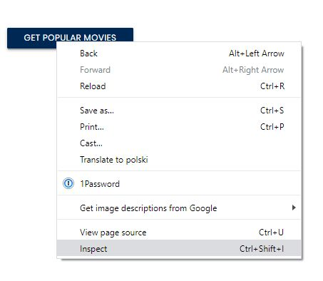
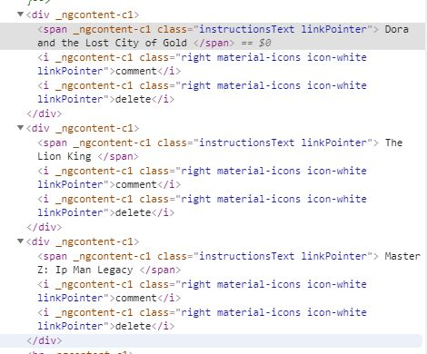
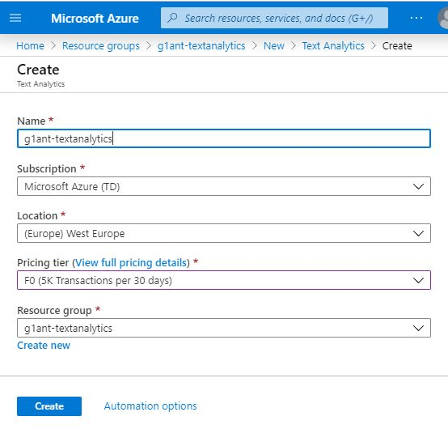

# RPAChallenge.com Movie Search

You can find out this excersise on the website [RPAChallenge.com//MovieSearch](http://rpachallenge.com/movieSearch):

1. The goal of this challenge is to create a workflow that will check which movie review is positive or negative.
2. Add 3 movies to your list in order to start the challenge. You can either search for them or get a list of 3 popular movies
3. Click on each movie in your Movie List in order to see the reviews. Check each review and see if it is positive or negative. Once you have checked all the reviews, press on Submit in order to see your score.

But, we still can find HTML items by 
like in our previous Excersise - 
We highly recommend to understand example [Find Forms](https://github.com/G1ANT-Robot/G1ANT.Hackaton.Tutorials/tree/master/RPAChallenge.InputForms), where is explanation how to use 
**getElementByXpath** function and [XPath](https://www.w3schools.com/xml/xpath_syntax.asp).

## Click GET POPULAR MOVIES

Open Chrome browser and click Inspect on the **GET POPULAR MOVIES** button. 
We can put this expression into Console tab, and we will see, that it's the correct button.



```JavaScript
getElementByXpath('//button[2]/text()')
```

So we can enter first code in G1ANT

```G1ANT
selenium.open chrome url http://rpachallenge.com/movieSearch
window ‴Rpa Challenge - Google Chrome‴ timeout 100000
selenium.click search //button[2] by xpath
```

After execution, the movie list should appear on the screen, on the left. Inspect first element.



so, we can find all element in the console:

```JavaScript
getElementByXpath('//div[@_ngcontent-c1][6]/span')
getElementByXpath('//div[@_ngcontent-c1][7]/span')
getElementByXpath('//div[@_ngcontent-c1][8]/span')
```

and this example will close the modal window:

```JavaScript
getElementByXpath('//i[@class="material-icons right modal-action modal-close "]').click()
```

and We can extend our G1ANT script to clicks that elements

```G1ANT
selenium.open chrome url http://rpachallenge.com/movieSearch
window ‴Rpa Challenge - Google Chrome‴ style maximize timeout 100000
selenium.click search //button[2] by xpath
for ♥index from 1 to 3
    call ProcessMovie number ♥index
end

procedure ProcessMovie number 1
    ♥itemNumber = ♥number + 5
    selenium.click search //div[@_ngcontent-c1][♥itemNumber]/span by xpath
    delay 1
    selenium.click search ‴//i[@class="material-icons right modal-action modal-close "]‴ by xpath
end
```

## How to detect sentiment?

OK, we have all the reviews and how we can detect, which text is positive or negative? 
It's time to use external AI webservice, like 
[Azure Sentiment Analysis API](https://azure.microsoft.com/en-us/services/cognitive-services/text-analytics/)

* The sentiment analyzer classifies text as predominantly positive or negative. It assigns a score in the range of 0 to 1. Values close to 0.5 are neutral or indeterminate. A score of 0.5 indicates neutrality. When a string can't be analyzed for sentiment or has no sentiment, the score is always 0.5 exactly. For example, if you pass in a Spanish string with an English language code, the score is 0.5.
* Output is returned immediately. You can stream the results to an application that accepts JSON or save the output to a file on the local system. Then, import the output into an application that you can use to sort, search, and manipulate the data.

Remember, to use that service it is neccessary to create Microsoft.IotHUB on Microsoft Azure.



There is explanation, how that service is working: 
[Sentiment Analysis is difficult, but AI may have an answer.](https://towardsdatascience.com/sentiment-analysis-is-difficult-but-ai-may-have-an-answer-a8c447110357)

And this is full documentation: [Text Analytics API (v2.1)](https://westcentralus.dev.cognitive.microsoft.com/docs/services/TextAnalytics-v2-1/operations/56f30ceeeda5650db055a3c9)

Come back to coding. 

