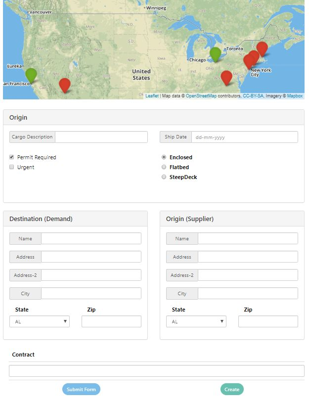
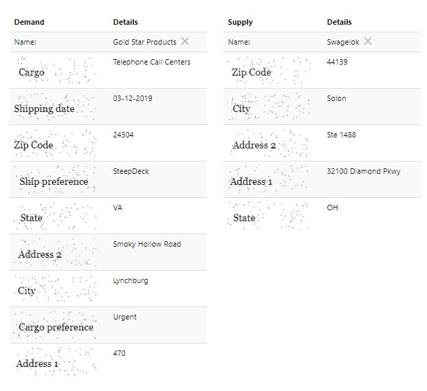

# RPAChallenge.com Shortest Path

You can find out this excersise on the website [RPAChallenge.com Shortest Path](http://rpachallenge.com/assets/shortestPath/public/shortestpath.html):

1. The goal of this challenge is to create an attended robot that works in tandem with the user.
2. The user needs to match one Demand (marked as a RED point) to the closest Supply (marked as a GREEN point) which will populate two tables with data.
3. The robot needs to fill the required data inside the form using the data in the tables generated at step 2. The form will return a contract value that needs to be inserted back in the 'Contract' text box.
4. Repeat until there are no more RED points on the map.



When you click "red" point, and after that "green" point, 
you will see two filled tables like that:



The difficulties based on captcha used within "Demand" and "Supply" labels, 
and we cann't use OCR recognition. But, we still can find HTML items by 
[XPath](https://www.w3schools.com/xml/xpath_syntax.asp) 
like in our previous Excersise - [Find Forms](https://github.com/G1ANT-Robot/G1ANT.Hackaton.Tutorials/tree/master/RPAChallenge.InputForms)
We highly recommend to understand that example, where is explanation how to use 
**getElementByXpath** function.

## Captcha hacking

For example, when we inspect "Zip Code", we can find these HTML Code:

```html
<tr>
    <td>
        
    </td>
    <td>87124</td>
</tr>
```

Let's try to find HTML element with that src:

```JavaScript
getElementByXpath('//img[@src="data:image/png;base64,iVBORw0KGgoAAAANSUhEUgAAAJYAAAAyCAYAAAC+jCIaAAAIaElEQVR4Xu2dB+g8xRXHP397jxAbliixJKggEVtUMEosiQaxYLBXsMQajAV7TVQsRKzRiJjYG4q9t9iNFXvsvStqbIl8ZAb2v+ze7t7t7e2VgT/H727mzds3331t3sx/Cs23ZYEfAbc1P/XQzTgv8M7QcQ1MGQDTWwFzAScMYO5hmnIdYB9gjWFiOvI6CGANo5wGxfOPgQ8GNXkv806A1Yv0JmNzJTABVjvAMSPw12D6PmkHS71xMQFWb/Krc/SOwBl1EhwkrSSw9gNuAR4cJEOTuX+QwGzA/4AvhlUeSWD5xtwJPN2Ch/ktcG0L+BgUC4cC3wFHZDDwhwC60wbFXJl522gK9TeuBnYGXizzECPSZx7gb8CWwKcdnmlF4P/AA21+7jYCq83yqsrbucANwPklB24IXF6yb6u7jSKwTL6+X4PUDwKuBJ7ogdYSwHM9jB/aoaMGrLWAA4DValgRfRn9vJdqoDV2JEYNWC7g0O6vjRL6RhFYTa/PUsBTTU8KzNLmdEQesP4YcimHD0BgwzTl7wDTNOs1zPTPQs5xyYIIsm62NgEeA54tIpwHrAUBw/5xCveLZNW235cGnmyYKQOa+4CbiuadmMIiCdX3+6bABT2SWwB4o0cajQyfAKuzmH8DXFfTSpjLOhh4oUt6WwDys3nO+BMB82aPdkm/1mHjBiwL524sEP5ywNrAZcDJgAV3bq+0oU0HfJvDyNZhx+LDNjA6bsDaFbgZeKaD8BcHVgfObMMCDSsPTQFrz1Bv5I79ODc14X+A50ddCE0By/r2I4FBq+ltgF8Bfiabfss/wheG078vE1J3AY5DQiSnmW1T0+Qb6V1VF1MRWKp/KxffTRB2AV4JWxrmTfRNflIw8arAI4COpPkd/74njNkduCPkQbrlPwmASEMgaNpctML8CmAq5fUcBgynN+ojsLp97n6P0/Tr9H9U10QRWEcBbwdnNdK2FsiM8oXhpMilwMXAXsCXCQZWAe4GjFr+CXgAwE+bQIiHATSHt2c4zmqKi4LjmfdckaamJAlWAe9YWx1aRn7/VBOtutZokHSUhZv6+1ZlImkKlwEsMNsgg4jg8W1OAsVuccFfzgBcWV6sL7q/Q+eZgwZcKWfBBZf14mrEMhrrp8HPyZqyrcCySkLzqQw+LyvYGvpNA8wKfFZA65fAvck+EViLhGjpMOC8HGD5dTRrsYtgU1P4eUUND5JFImpEc0BZFZWOUYtaiVAErJ+HKln5fRh4KDVhW4Elm0UvYFnx6+ueArxVdkBBP6t9tVabZQHL7zyhrH+U1RYCXkv9EBf8dODrYB7PCaZJ7WeBmwtl3Xb0ufSH9IUEsH1s0YTm8S8I3LNMmsAimUQTGeeIvGiW1bJWaT4O+Azp/dAs5z0+a5y3iOci/gb5u+bNStWPa2DCbb+vsuh0GxXGhXPfKPpcJh+PBaLpUgsmTWcEiCdR4pjojKe1kYu/B/DnlBkUpGmAp58r7fNlmdKs76JZny9lciOPEdiRfhWg17CGfSFRVQu6Tu5EeOCm405AN8Aq8nmUgIuhVkgCK8/MZEViswMmM01SGgi42Dr/ah4j07z7DPJ8PjWme3WaAM1pBEta86R5zKJXh1/ZF5R0QfRWwMDN01ll2g7hzo1YnJBb+9YNsPIWJclYFWB1opfWIh4y6OQbpLVV5MmX4SRgYWD74BNmBQNpYGXRy9PIZRZmEH18EV+taWJ91Kxdi/Tm+C+qAivLBGbxXAVYeWCQblzEdE4sT06dgKXW0jxHYKVNddS0yXRD2rdKzpv022pat76QUSvpolzfI3XzmromRoDJZsGhQZNOvOcDNK9nVgFWkQl0EVwsTVcVYBVpwCw/TE1mwBDDYAHvg3kkKplTS2qsqsBSQKr8LHo9rlGjw3UritIFZRmaIcg93V9XxTxobNMUAWtu4D1gJ+Ab4KycKC6aLP0XUxJVgFWU7c7SWkZyJml9g/zdKPPscDpHYKfzalHTmgtK+lhpB1y+DUJMXSisvcOLkpWns6/fp1MwZRdppPt1ApblIy6SNd0CaoWQA0pn3rMWPgssUfNkRYVF4Xsy857sG+e+K5Htz4sKFwW2C1FlVgSYnMM9s/XDymdpVOfw3qq8vNpIg6bMwxVpLPNXhvgCzO2UTs38jzVBEVSxb9QK0TE2ovOYVvr3Mvym9wrzNozTeSzB7D6oL4s3CR6X8t+cW5/Jf/FCuOQLkPa1YnrEfcV/h0z+ysC/yjzEOPQpAlY3MjgwmM/0zSkRWLuEDe+8ky1qFZOX6ax4kpc5Q5WCB0qrNA8f6CfUVWWpxvK+i/8CfwkJ17L8bAy8WQBG+7hHG9u2gEno1rd+ACvvoSOwPEKuCds/p6OJUbWAC5bXPJDqiREPlVZtFvodU+ZAQFXCFfv7glllkVeqMlM4mr9bos7978EitL7uvWlgWcnQdMbaK4EMtz3SpmbRHHbShhEfbsDqxJuY7VRxWhFP49G9TmBZ02VZjcBJ7sAnnfso1aZzQGqHU7tY0nWBa7oYN8xD5g8muuwzTJt1JqBOYMnIxIEtuxzt7GfQY/rECLrMlZVuQusP6wtOdXlK3cBqp7gmXFWRQFWNlVkVMwFWFZE309eyIg+dDHWOrAqw3LS1TGbS+iuBOcKNfXVtw/SX2xzqZYHlw2p7LVvOOsnrxbhGUUcP5Ckmk7ZOAmWBVcS4J1+kVVSEV0Rn8jt42YfbRdbxD22rC1hDK4AWMm459a+B41vIW2mWJsAqLaqpOk4fSoRG/kRzd+IZzP/+1S2vbRrnfuby4crwNvHVT14Wq3JTThWNZdKs6YvYrLG6pIbqx34KfFxoe3DZTX8/C1tZYHloUbW/ZsP3berEWoriHt+kDZEEvgfVV+ZGvf5vVwAAAABJRU5ErkJggg=="]')
​
```

So, that's the way how we can find out all HTML elements protected by captcha.

```G1ANT
```
